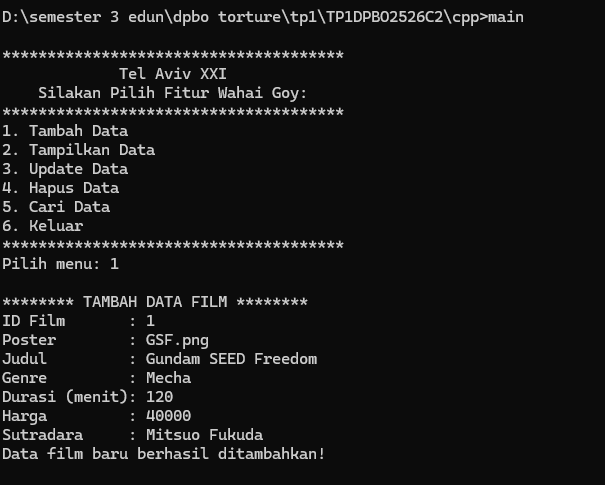
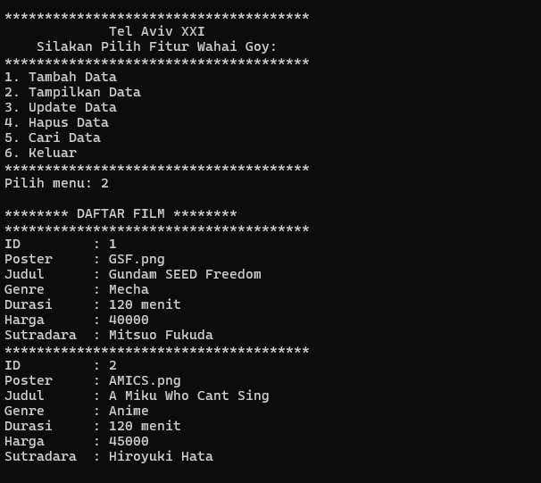
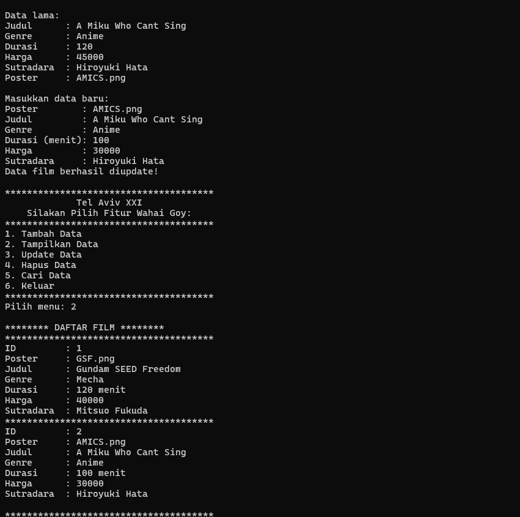
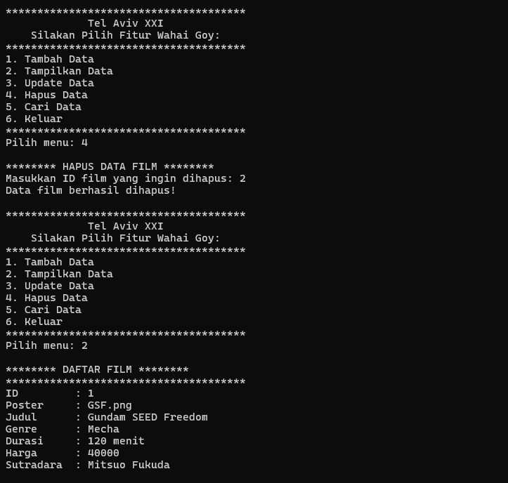
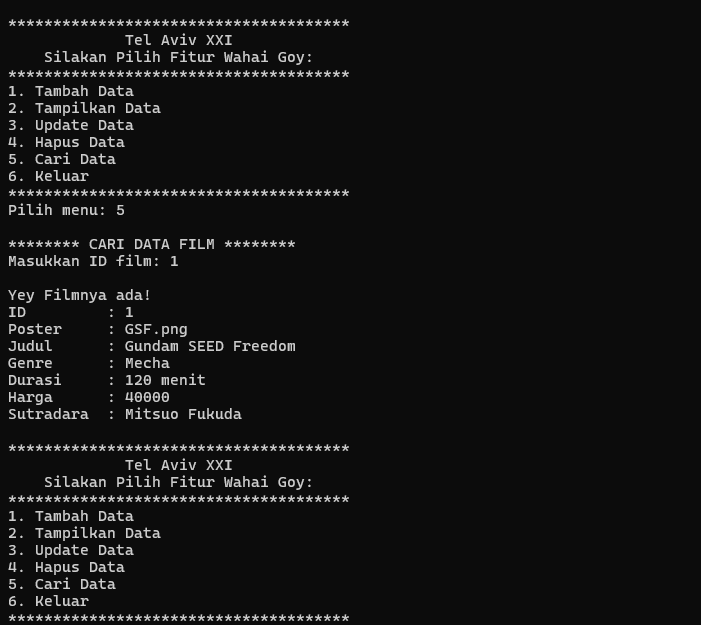

# TP 1 DPBO C2 2026
# Janji: 
Saya Nabil Azka Saputra dengan NIM 2507096 mengerjakan Tugas Praktikum 1 pada Mata Kuliah Desain dan Pemrograman Berorientasi Objek untuk keberkahan-Nya maka saya tidak melakukan kecurangan seperti yang telah dispesifikasikan. Aamiin

## 📌 Fitur

Program memiliki fitur utama sebagai berikut:

### 1. Tambah Data
Menambahkan data film baru ke dalam daftar.

Data yang dimasukkan meliputi:

- ID Film
- Poster
- Judul
- Genre
- Durasi
- Harga
- Sutradara

ID film harus bersifat unik sehingga tidak boleh sama dengan ID film yang sudah tersimpan.

### 2. Tampilkan Data
Menampilkan seluruh data film yang tersimpan.

Pada versi CLI, data ditampilkan melalui terminal. Sedangkan pada versi web PHP, data ditampilkan dalam bentuk tabel.

### 3. Update Data
Mengubah data film berdasarkan **ID Film** sebagai identifier unik.

Data yang dapat diperbarui:

- Poster
- Judul
- Genre
- Durasi
- Harga
- Sutradara

### 4. Hapus Data
Menghapus data film berdasarkan ID Film.

### 5. Cari Data
Mencari data film tertentu berdasarkan ID.

Pada versi PHP, pencarian juga dapat dilakukan berdasarkan **ID atau Judul film**.

---

## Atribut Class Film

Class `Film` digunakan sebagai representasi objek film.

Setiap objek Film memiliki 7 atribut:

| Atribut | Tipe Data | Keterangan |
|---|---|---|
| `id` | Integer | Identifier unik film |
| `poster` | String | Path file poster |
| `judul` | String | Judul film |
| `genre` | String | Genre film |
| `durasi` | Integer | Durasi film dalam menit |
| `harga` | Integer | Harga tiket |
| `sutradara` | String | Nama sutradara |

Class juga menyediakan **getter dan setter** untuk mengakses serta mengubah atribut objek.

Implementasi atribut tersebut terdapat pada class Film di C++, Java, PHP, dan Python. 

## Error Handling
- ID, harga, dan durasi tidak bisa alphabet dan kurang dari 0
- Tidak bisa memilih diluar pilihan angka

# Dokumentasi
- Python
  - Tambah
  - Tampilkan
  - Update
  - Hapus
  - Mencari
- C++
  - Tambah
  
  - Tampilkan
  
  - Update
  
  - Hapus
  
  - Mencari
  
- Java
  - Tambah
  - Tampilkan
  - Update
  - Hapus
  - Mencari
- PHP
  - Tambah
  - Tampilkan
  - Update
  - Hapus
  - Mencari
